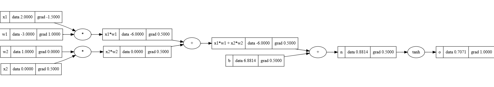

# Mathematical-Foundations-of-Neural-Networks-with-Micrograd
This repository is designed for educational purposes to help participants explore the mathematical foundations of neural networks by building a simple backpropagation-based neural network from scratch. We will draw inspiration from Micrograd, a lightweight autograd engine developed by Andrej Karpathy.

Understanding Micrograd at the scalar level offers a great way to grasp how PyTorch's built-in classes function. By exploring how each Value class manages its children to construct an accurate topological sorting graph for backpropagation, we gain deeper insights into computational graph structures. This presents an excellent opportunity to manually implement gradient calculations through the graph, which enhances comprehension of fundamental concepts like automatic differentiation. Micrograd's simplicity makes it ideal for learning these principles without the complexity of large-scale frameworks




## Setup and Execution :
Go to the **src** :

1. Create a Virtual Environment::

```bash
python -m venv venv
venv\Scripts\activate
```

2. Install Requirements::

```bash
pip install -r requirements.txt
```

3. Build/Modify "mlp_training.py" and highlight your understanding by Executing the mlp network::
```bash
pip mlp_training.py
```
